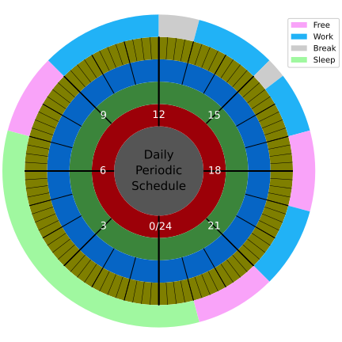

Daily Periodic Schedule
================================

This is a utility to plot the daily schedule.

Requirements
++++++++++++++++++++++

Python3

Matplotlib

Numpy

Usage
++++++++++++++++++++++

The Arguments of the Utitity
-------------------------------

You need to modify the :code:`schedule.tsv` file and and provide it to the utility to generate the plot.

.. code:: python

    usage: daily-peirodic-schedule.py [-h] --conf CONF [--out OUT] schedual

    plot daily periodic schedule

    positional arguments:
    schedual     Assignment file

    options:
    -h, --help   show this help message and exit
    --conf CONF  configuration file
    --out OUT    out file name

Configure file
---------------------------

:code:`conf.toml` used to configure the utility change its behave.
There are file rings in the plot, named r0, r1, ..., r4, you can change the
color of the ring in **[ticks-ring-color]** field. 

In the configure file, four **schedual-types** have been defined(Free, Break, Sleep, Work).
If you need modify or add new **schedule-type**, you need edit this field.

.. code:: sh

    [ticks-ring-color]
    r0 = "#555555"
    r1 = "#9c0008"
    r2 = "#3b853b"
    r3 = "#0665c5"
    r4 = "#7f7f00"

    [schedual-type]
    Free = "#f9a3f9"
    Break = "#cccccc"
    Sleep = "#a0f8a0"
    Work = "#21b2f6"

Schedule File
----------------------------

The schedual file has three columns, from left to right, they are start time,
end time, and **schedual-type** repectively.

Edit this file to schedual you daily peirodicly.

.. code:: sh

    7:00	9:00	Free
    9:00	11:45	Work
    11:45	12:45	Break
    12:45	15:00	Work
    15:00	15:30	Break
    15:30	17:00	Work
    17:00	19:00	Free
    19:00	21:00	Work
    21:00	23:00	Free
    23:00	7:00	Sleep

Example
++++++++++++++++++++++

.. code:: sh

    python3 daily-periodic-schedule.py \
        --conf conf.toml \
        --out example-plot \
        schedule.tsv

